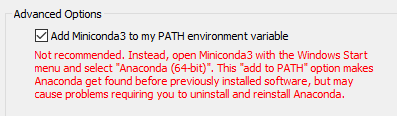
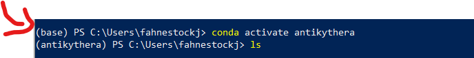

[Link to github repo](https://github.com/fahnestockj/ELEC3225AntikytheraProject)

# Installing and setting up the project
Clone the repository!

To run the project locally you need to install several packages. We used anaconda to manage our packages with a virtual environment.

## Conda 
 Assuming you've installed miniconda or anaconda
  * [you can do that here](https://docs.conda.io/en/latest/miniconda.html)

  ### if installing for the first time make sure to check the add to my PATH box
  

## Env setup
 Move to root directory of this project (ELEC3225AntikytheraProject) 
 
 Run this command:

`conda env create --name antikythera --file=environment.yml`

 This creates a virtual enviroment with the relevant packages that needs to be activated to be used

## Windows powershell problems
To set up a conda in Powershell you need to be able to run
`conda init powershell`
This creates a powershell profile which needs permissions

Most likely you'll get a permissions error

To fix this 
* run powershell as an administrator
* run:
 `Set-ExecutionPolicy -ExecutionPolicy Unrestricted` 

* accept all
* rerun `conda init powershell`
* relaunch powershell

You should be able to see your conda env to the left of your path in parenthesis like this:

to activate the venv run:

`conda activate antikythera`

Then to run the project run:
`python main.py`

Alternatively assuming your in vscode you can set your interpreter to be the conda env by opening the command pallete and typing
`Python: Select Interpreter`

Then select the antikythera python version, and run main.py from the IDE.

# User Guide 
Open up main.py and run it (with the virtual env running / set as your vscode interpreter). This is the main menu. You will be given choices:
1. Search in database
2. View solar eclipse dates
3. View lunar eclipse dates
4. View solar conjunction dates
5. View solar system simulation

## 1. Search in database
* Users input a date and choose an astronomical event to see the attributes for the event, if one exists at that date.
## 2. View solar eclipse dates
* Queries the dates of all solar eclipses stored in the database that can be used to start the simulation from
## 3. View lunar eclipse dates
* Queries the dates of all lunar eclipses stored in the database that can be used to start the simulation from
## 4. View solar conjunction dates
* Queries the dates of all solar conjunctions stored in the database that can be used to start the simulation from
## 5. View solar system simulation
* User inputs a date to start the simulation from
* Simulation runs in a separate window
* User can pause, resume, and select view: inner planets or outer planets, depending on what they want to see
